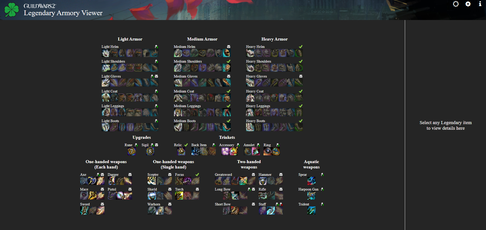

# Guild Wars 2 Legendary Armory Viewer for Web
Single-page Web application for viewing your Guild Wars 2 legendary items usage information. Application is developed with Vue.js.

## Build
### Prerequisites
Install Node.js
### Development
To install dependecies for the project use the `npm install` command.
```
$ npm install
```
During development you can use the `npm run dev` command for starting a dev server.
### Building the App
You may run `npm run build` command to build the app.
```
$ npm run build
```
By default, the build output will be placed at `dist`. You may deploy this `dist` folder to any of your preferred platforms.
### Testing the App Locally
Once you've built the app, you may test it locally by running `npm run preview` command.
```
$ npm run preview
```
The `vite preview` command will boot up a local static web server that serves the files from `dist` at `http://localhost:4173`. It's an easy way to check if the production build looks OK in your local environment.
You may configure the port of the server by passing the `--port` flag as an argument.
```
{
  "scripts": {
    "preview": "vite preview --port 8080"
  }
}
```
Now the `preview` command will launch the server at `http://localhost:8080`.

## Screenshot


## License
This application is licensed under MIT license.

### Graphics
© ArenaNet LLC. All rights reserved. NCSOFT, ArenaNet, Guild Wars, Guild Wars 2, GW2, Guild Wars 2: Heart of Thorns, Guild Wars 2: Path of Fire, Guild Wars 2: End of Dragons, and Guild Wars 2: Secrets of the Obscure and all associated logos, designs, and composite marks are trademarks or registered trademarks of NCSOFT Corporation.
